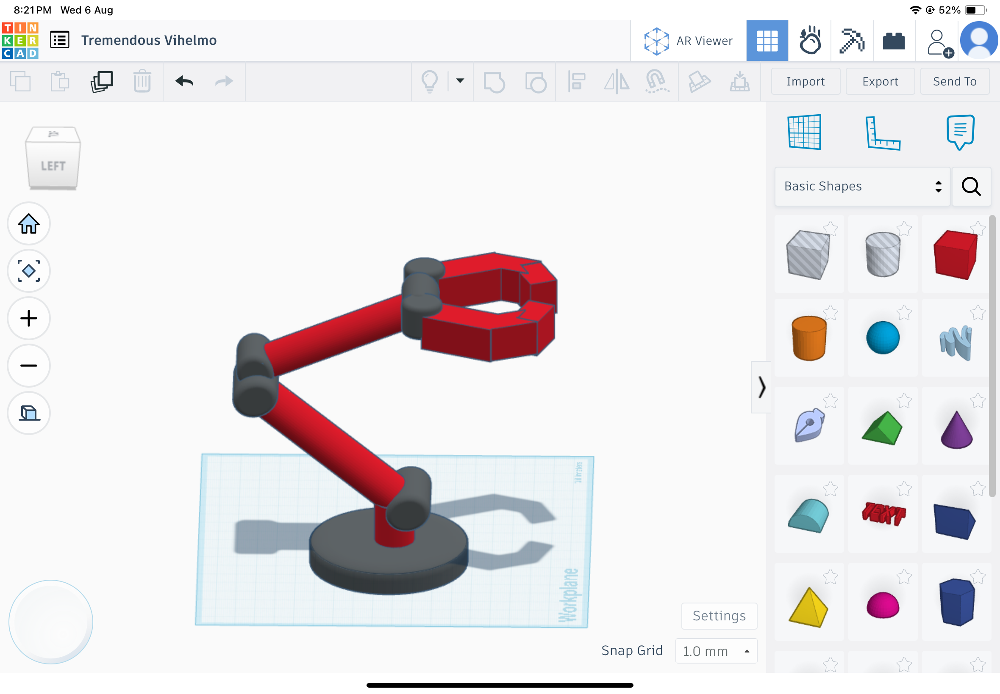

# Robotic-arm-5DOF
A 3D robotic arm with 5 degrees of freedom designed in TinkerCAD.
# 🤖 Robotic Arm - 5 Degrees of Freedom (3D Model)

This project presents a 3D-designed robotic arm with 5 Degrees of Freedom (5DOF) built using TinkerCAD. The design simulates the basic movement capabilities of an actual robotic arm, including shoulder, elbow, wrist, and gripper components.

---

## 🛠 Tools & Software
- 💻 Designed in: [TinkerCAD](https://www.tinkercad.com/)
- 📦 File Format: .STL for 3D modeling and printing
- 📁 Platform: GitHub (for storing and versioning design files)

---

## 🧩 Arm Structure

| Part           | Description                               |
|----------------|-------------------------------------------|
| Base           | Stable foundation of the arm              |
| Shoulder Joint | First rotational axis                     |
| Elbow Joint    | Allows bending motion like human elbow    |
| Wrist Joint    | Provides rotational flexibility            |
| Gripper        | End effector used to grab objects         |

---

## 🎯 Project Goals
- Understand the basic structure of robotic arms.
- Practice 3D design and mechanical assembly using TinkerCAD.
- Export and share the design files for future use (e.g. simulation or 3D printing).

---

## 📂 Files Included
- robotic_arm.stl: Main 3D model file
- preview.png: Image showing the final design

---

## 🖼 Preview

Here is the 3D model preview of the robotic arm designed in TinkerCAD:

---

## ✨ Created by:
Renad Amin  
3D Robotic Arm Project – 2025
